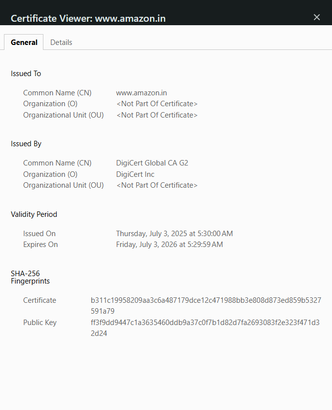

### MEAN STACK
    - M: MongoDB (Database)
    - E: ExpressJs (Backend)
    - A: Angular (Frontend)
    - N: NodeJs (Backend)

### Three Pillars
    - HTML (Hyper Text Markup language)
    - CSS (Cascading Style Sheet)
    - JS (Java Script)
Other Stacks:  
MEAN, MERN, Java Full Stack

### Web Dev
    - Building/Developers Team
    - Testing Team (Manual testers/Automated Testers)
    - Hosting Team (DevOps Team)
    - Maintenence Team/Support Team

### SDLC (Software Development Life Cycle)
    1. Waterfall model
    2. Agile MOdel
    3. Spiral Model
    4. Iterative Model
    5. Incremental Model
    6. V shaped Model
    7. RAD (Rapid Application Development) Model

URL (Uniform Resource Locator)
    https://www.instagram.com/
    https://education.mishalAcademy.edu/FullStack  

    https: Protocol  
    mishalAcademy: Server/Domain Name  
    education: sub-Domain  
    .edu: TLD (Top Level Domain)  
    FullStack: Path/Location  

#### Protocol:  
    Set of rules/instructions  
        http: Hyper Text Transfer Protocol  
        https: Hyper text Transfer Protocol Secure    
        tcp: Transmission Control Protocol  
        udp: User Datagram Protocol  
        smtp: Simple Mail Transfer Protocol  (gmail if no subject, alert)  
        ftp: File Transfer Protocol (same file names not allowed)  
        ip: Internet Protocol (ipv4 & ipv6) (smart AC -> ip address)
            -> Client/Web Page ------------(uName & uPwd) -----------> Instagram Server  
            (credentials are sent through the network)  
            
            -> 3rd party who watches communication btw client and servers  
            they can easily get these credentials and hack misuse our apps Bank/apps.  
            Inorder to avoid this, https->data tranferred will be secure.  
            educational sites public -> http is okay  
            -> SSL certification (Secure Socket Layer Certification)  

Server/Domain Name: Unique Identifier(eg:Google,Infosys)  
Sub-Domain Name: gmeet, gdocs, gdrive, gphotos,Gmail,gpay    
 https://meet.google.com/landing  meet->subdomain, google->maindomain    
 https://aws.amazon.com/free aws->subdomain, amazon->maindomain  

#### TLD (Top Level Domain)  
Amazon.uk  
Amazon.in  
Amazon.org  
Amazon.in  
Amazon.com  
Amazon.edu  

### Offline editors
1. Notepad
2. Notepad++
3. Sublime
4. Open Brackets
5. VS Code

### Online Editors
1. CodeSpace
2. CodeSandbox

